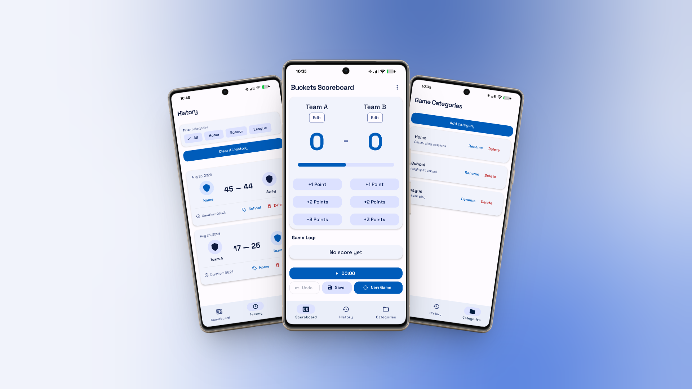

# Buckets

A modern basketball scoreboard app built with React Native and Expo. Buckets makes it easy to track scores during games, save game history, and quickly review previous games through a clean, native-style interface.



## Features

- **Live Score Tracking**: Track scores while playing and quickly update points during a game.
- **Game History**: Save completed games and review previous scores.
- **Multiple Game Formats**: Support for different game setups, including 1v1 and team games.
- **Player Names**: Add player names to keep games organized.
- **Light & Dark Mode**: Automatically adapt the interface to the selected theme.
- **Native UI**: Built with React Native Paper and designed to feel at home on Android.
- **Local Storage**: Game data is stored locally on the device using AsyncStorage.

## Tech Stack

- **React Native**: Cross-platform mobile application framework
- **Expo**: Development and build tooling
- **TypeScript**: Type-safe application development
- **React Native Paper**: Material Design component library
- **Expo Router**: File-based navigation
- **AsyncStorage**: Local data persistence

## Getting Started

### Prerequisites

Make sure you have the following installed:

- [Node.js](https://nodejs.org/)
- npm
- [Expo CLI](https://docs.expo.dev/get-started/installation/)
- Android Studio for Android development
- Xcode for iOS development on macOS
### Installation

Clone the repository:

```bash
git clone https://github.com/your-username/buckets.git
cd buckets

```
---
Copyright © 2026 David Olaniyan. All rights reserved.